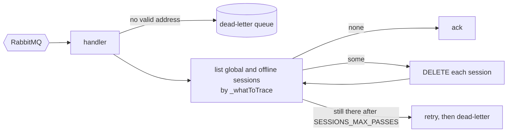

# twake-sessions-service

Ends a user's LemonLDAP::NG sessions when the user is deleted or disabled, on SaaS and on-prem ([ADR 059](https://github.com/linagora/twake-workplace-private/pull/1743)).

## Events

- `auth` / `user.deleted` (B2C deletion), queue `sessions-service.user-deleted`, reads `internalEmail`
- `b2b` / `domain.user.deleted` (B2B and on-prem deletion), queue `sessions-service.domain-user-deleted`, reads `internalEmail`
- `b2b` / `b2b.member.disabled`, queue `sessions-service.member-disabled`, reads `email`

Each queue is a quorum queue with a `<queue>.dlq` behind `<exchange>.dlx`, declared by `@linagora/rabbitmq-client`.

## How sessions are ended



- Global and offline (OIDC refresh token) sessions are both listed on every event.
- The manager's list decides success. A DELETE on a session that is already gone answers 500, so a refused DELETE only matters if the session is still listed afterwards.
- A user with no session is a success, so replaying an event is safe.
- A failed list throws, it is never read as "no sessions".
- A message without a valid address is dead-lettered, so it shows on the dashboard failures page. `*` is rejected, since the manager treats it as a wildcard.

Sessions are looked up by lowercased email in `_whatToTrace`. Federated (SAML, OIDC) sessions are only found once `whatToTrace = lc($mail)` is deployed ([#1816](https://github.com/linagora/twake-workplace-private/issues/1816)).

## LemonLDAP calls

- `GET {portal}` then `POST {portal}` with the admin account, to get the admin session cookie. It is cached, and renewed when the manager answers 401 or redirects to the portal.
- `GET {manager}/manager.psgi/sessions/{global|offline}?_whatToTrace={email}`
- `DELETE {manager}/manager.psgi/sessions/{global|offline}/{id}`

The admin account needs access to the manager's sessions API. On-prem, the operator provides both.

## Configuration

See [.env.example](.env.example). Required: `RABBITMQ_URL`, `LLNG_MANAGER_URL`, `LLNG_PORTAL_URL`, `LLNG_ADMIN_USER`, `LLNG_ADMIN_PASSWORD`. `RABBITMQ_URL` and `LLNG_ADMIN_PASSWORD` are secrets.

`GET /healthz` on `PORT` answers 200 while the RabbitMQ connection is up, 503 otherwise.

## Development

```sh
npm ci
npm run typecheck && npm run lint && npm test
cp .env.example .env && npm run dev
```

## Testing

- Unit tests mock `fetch` for the LemonLDAP calls and call the handlers directly.
- The LemonLDAP client was run once against LemonLDAP::NG 2.20.2: admin login, listing and deleting global sessions, a replay, the 500 on a session already gone, and the 302 on an expired admin cookie. Deleting a real offline session was not tried.
- The service has not been run against a live RabbitMQ broker yet. Queue and dead-letter declaration come from `@linagora/rabbitmq-client`.
