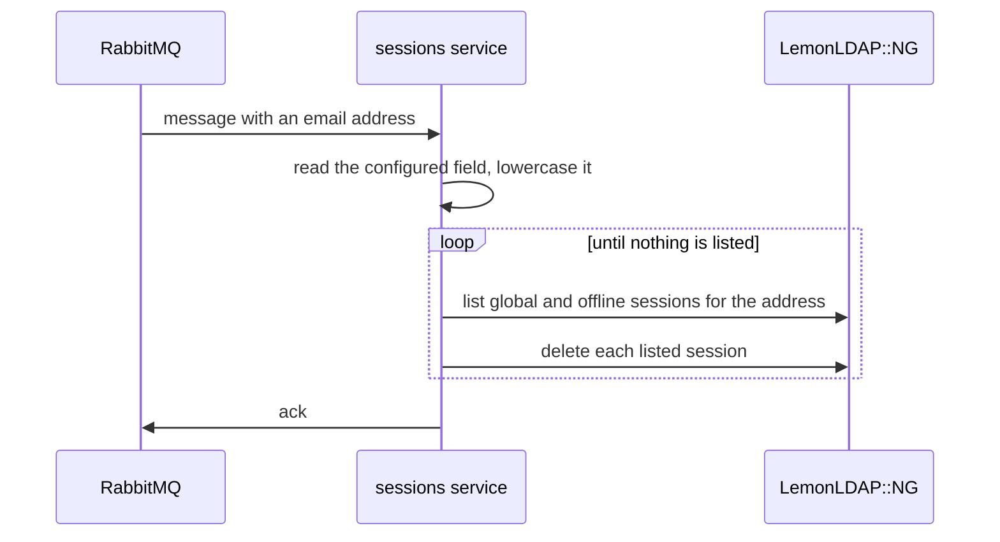

# How it works

The service consumes RabbitMQ messages that name a user by email address, and ends that user's LemonLDAP::NG sessions through the manager's sessions API.

## Handling a message

- The address comes from the field set as `emailField` in the subscription. It is trimmed and lowercased.
- Both session kinds are listed on every message:
  - `global`: the user's SSO sessions.
  - `offline`: OIDC offline sessions, which hold refresh tokens.
- Sessions are looked up by `_whatToTrace` with the lowercased address, so LemonLDAP::NG has to trace users by lowercased email address.

## When is a message done

- The service lists the sessions, deletes each one, then lists again.
- The message is done when a list comes back empty. A user with no session is a success, so the same message can be handled twice.
- A failed delete is not an error by itself. The manager answers 500 when asked to delete a session that is already gone, so only the next list says whether it is still there.
- If sessions are still listed after `SESSIONS_MAX_PASSES` rounds of deletes, the message fails.

## Failures

- A message without a valid address in the configured field fails. So does an address containing `*`, which the manager would read as a wildcard.
- A failed list, a failed admin login, or a LemonLDAP::NG call that takes longer than 30 seconds fails the message.
- A failing message is tried `RABBITMQ_MAX_RETRIES` times in total, `RABBITMQ_RETRY_DELAY` milliseconds apart. After the last attempt it goes to the dead-letter queue.

## Queues

- Each subscription declares a quorum queue bound to its exchange and routing key.
- Each queue gets a dead-letter queue named `<queue>.dlq`, bound to the `<exchange>.dlx` exchange.
- Messages that are not valid JSON go straight to the dead-letter queue.

## Talking to LemonLDAP::NG

- The service logs in to the portal with the admin account: a `GET` for the login token, then a `POST` with the credentials. The returned session id is sent as the admin cookie.
- The admin session is reused across messages. When the manager answers 401, or redirects to the portal, the service logs in again and retries once.
- Listing: `GET /manager.psgi/sessions/{global|offline}?_whatToTrace={email}`
- Deleting: `DELETE /manager.psgi/sessions/{global|offline}/{id}`
